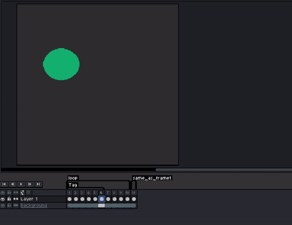
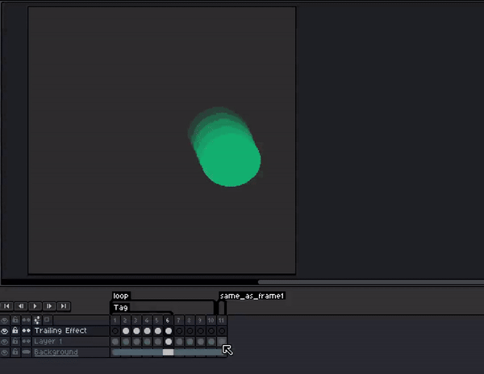
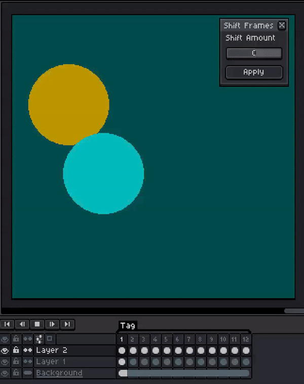
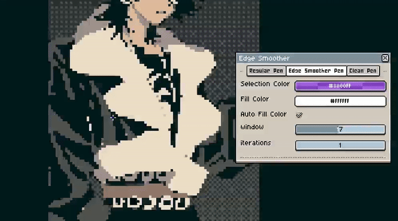
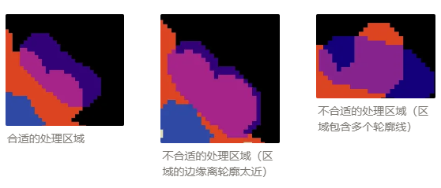
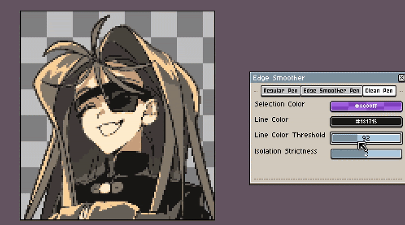
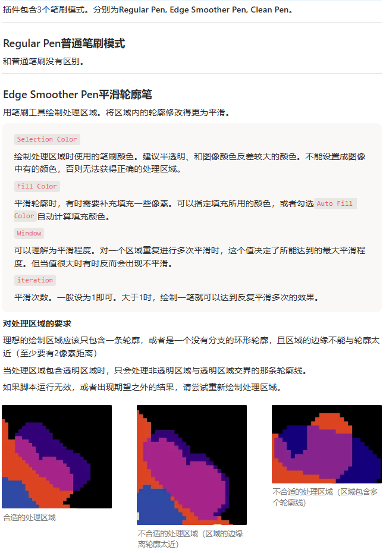
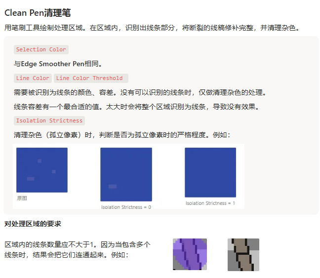

# Aseprite Scripts by pepe
lua脚本插件。可以自由使用、更改。

## 如何导入
### 脚本（Scripts）
- Add Easing Animation
- Circular Shift

下载对应的.lua文件，放入Aseprite的脚本文件中。
### 扩展（Extensions）
- Fix Pen Kit

Edit → Preferences → Extensions → Add Extension → 选择文件（直接选择.zip文件，不解压缩） → Apply.
扩展工具名称将出现在Edit菜单中。点击使用。

## Add Easing Animation
给cel序列添加位置和尺寸的补间动画。  
运动路径可以是曲线。支持各种缓动补间方式，且可以生成残影拖尾。  

#### 使用方法
- 选择一个图层的多个连续cel后调用脚本，将根据第一个cel和最后一个cel中图像的位置和尺寸生成中间各单元格的动画。
- 位置以**左上角顶点**为基准，而不是图像的中心。
- 移动时，不勾选贝塞尔曲线（Bézier curve）时沿直线移动，勾选时沿贝塞尔曲线移动。如果贝塞尔曲线控制点的移动范围太小，可以将画布放大。
- 拖尾的最大值和最小值：运动速度越快时，拖尾长度越接近于最大值。运动速度越慢时，拖尾长度越接近于最小值。
  
>⚠️在index模式下，运动路径和拖尾可能会出现显示错误。  
>⚠️如果不希望应用此次操作，不点击Apply，直接关闭脚本窗口即可。建议避免Apply后使用撤销，因为单次撤销无法直接回到应用前的状态。

## Circular Shift
循环错帧。例如：当移动cel时，若最后方的cel超出了循环的范围，就将它们移动到最前方，保证循环完整。

#### 使用方法
- 选择一个图层的多个连续cel后调用脚本。选中的cel将会被整体向前或向后移动，同时保证循环的完整。

>⚠️如果不希望应用此次操作，不点击Apply，直接关闭脚本窗口即可。建议避免Apply后使用撤销，因为单次撤销无法直接回到应用前的状态。

## Fix Pen Kit
像素修整扩展工具。包含3个笔刷模式。
### 1.Regular Pen 普通笔刷
和普通笔刷没有区别。
### 2.Edge Smoother Pen 平滑轮廓笔  
用笔刷工具绘制处理区域。将区域内的轮廓修改得更为平滑。

**参数说明**
- Selection Color  
绘制处理区域时使用的笔刷颜色。建议半透明、和图像颜色反差较大的颜色。不能设置成图像中有的颜色，否则无法获得正确的处理区域。
- Fill Color  
平滑轮廓时，有时需要补充填充一些像素。可以指定填充所用的颜色，或者勾选`Auto Fill Color`自动计算填充颜色。
- Window  
可以理解为平滑程度。对一个区域重复进行多次平滑时，这个值决定了所能达到的最大平滑程度。但当值很大时有时反而会出现不平滑。
- Iteration  
平滑次数。一般设为1即可。大于1时，绘制一笔就可以达到反复平滑多次的效果。

**对处理区域的要求**
- 理想的绘制区域应该只包含一条轮廓，或者是一个没有分支的环形轮廓，且区域的边缘不能与轮廓太近（至少要有2像素距离）
- 当处理区域包含透明区域时，只会处理非透明区域与透明区域交界的那条轮廓线。
- 如果脚本运行无效，或者出现期望之外的结果，请尝试重新绘制处理区域。

### 3.Clean Pen 清理笔
用笔刷工具绘制处理区域。在区域内，识别出线条部分，将断裂的线稿修补完整，并清理杂色。

**参数说明**
- Selection Color  
与Edge Smoother Pen相同
- Line Color 、 Line Color Threshold 
需要被识别为线条的颜色、容差。没有可以识别的线条时，仅做清理杂色的处理。  
线条容差有一个最合适的值。太大时会将整个区域识别为线条，导致没有效果。
- Isolation Strictness  
清理杂色（孤立像素）时，判断是否为孤立像素时的严格程度。例如：

**对处理区域的要求**

区域内的线条数量应不大于1。因为当包含多个线条时，结果会把它们连通起来。例如：  

### 其他注意事项
>⚠️无法在index模式使用。  
>⚠️切换打开的文件时，需要重新打开Fix Pen Kit。  
>⚠️图像大时处理会变慢。

